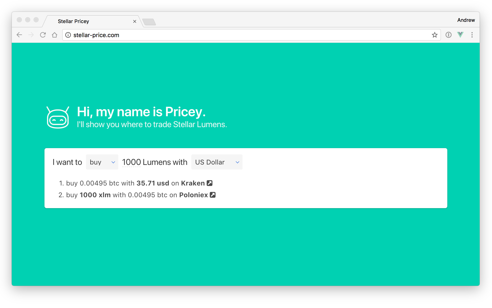

# Pricey

For new users it's often confusing to figure out where they can buy or sell Stellar Lumens. We've created [stellar-price.com](http://stellar-price.com) to help users find the best exchange rate.

The user can chose from 4 quote currencies (USD, EUR, BTC and ETH) and set the amount of Lumens. Stellar Price computes the optimal currency exchange route by tracking 16 currency pairs on 5 popular exchanges, which gives it a total of 28 possible routing combinations. We've chosen popular exchanges with a good reputation and good liquidity to minimize counterparty risk for users.

Under the hood, Stellar Price uses websockets to communicate between the Phoenix backend and the Vue.js frontend. We picked Phoenix for its robust websocket implementation and because the Elixir language makes it easy to reliably parallelise api requests. The source code is released as open source at [github.com/andruby/pricey](https://github.com/andruby/pricey) because we believe in giving back to the community, and in order to encourage community involvement.

What sets Stellar Price apart is that it's simple and straight forward to use. The data is updated in real-time and uses ask/bid prices for better accuracy. We want to add historic tracking and charts so we can reveal which exchange routes are stable, and we want to integrate with more exchanges, such as the Stellar Decentralised Exchange to provide a more complete picture. We're thinking about adding anomaly detection when currency pairs deviate too much from the mean to protect users from failing exchanges.

More info on  [galactictalk.org/d/567-realtime-stellar-price-info](https://galactictalk.org/d/567-realtime-stellar-price-info)

## Development

To start your Phoenix server:

  * Install dependencies with `mix deps.get`
  * Create and migrate your database with `mix ecto.create && mix ecto.migrate`
  * Install Node.js dependencies with `cd assets && npm install`
  * Start Phoenix endpoint with `mix phx.server`

Now you can visit [`localhost:4000`](http://localhost:4000) from your browser.

## Learn more

  * Official website: http://www.phoenixframework.org/
  * Guides: http://phoenixframework.org/docs/overview
  * Docs: https://hexdocs.pm/phoenix
  * Mailing list: http://groups.google.com/group/phoenix-talk
  * Source: https://github.com/phoenixframework/phoenix
